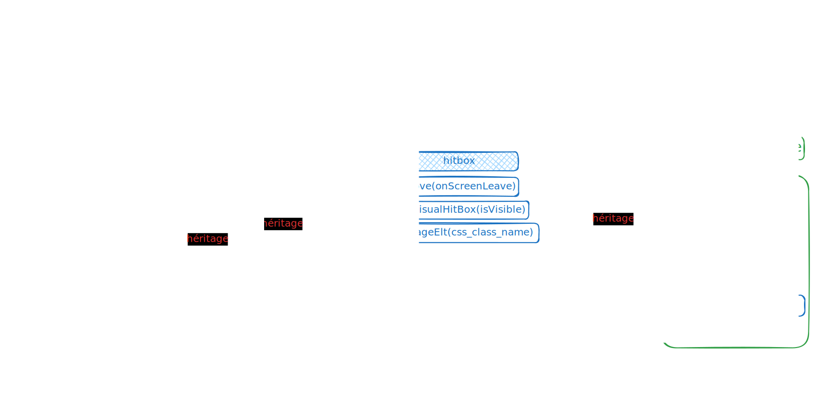

# Vue d'ensemble

À mesure que les fonctionnalités arrivent, le projet gagne en complexité (un projet informatique, quoi...).

Je vous propose d'en parcourir les éléments constituants, par thématiques.

## Genèse

Au moment de démarrer, j'ai commencé par rassembler des briques logicielles, provenant de mes précédents projets. Tel que je voyais l'architecture logicielle du projet à ce moment-là, elle devait ressembler à ceci :

Puis, une chose en entrainant une autre, la quasi-totalité de l'architecture a évolué, afin d'accueillir les nouvelles fonctionnalités, sans trop introduire de complexité inutile (si vous êtes développeur, vous savez ce que c'est :smirk:)

Les quatre gros morceaux que j'ai conservés sont les suivants :

### Configuration de la manette

le couple `GamepadGenericAdapter` + `GamepadConfigUI`, me permet d'abstraire l'API native Gamepad, en générant une liste d'actions (avec fonction à exécuter au déclenchement), puis en mappant ces actions aux boutons de la manette via l'UI de configuration, dont l'ouverture automatique est déclenchée lorsqu'une manette est détectée.

### ViewPortCompatibility

Cette classe gère un système de coordonnées virtuelles, et s'occupe de convertir ces valeurs de coordonnées en positionnement réel dans la viewport.

Pour faire simple : 

* elle assume un axe principal et une dimension virtuelle pour cet axe
* elle met à jour dynamiquement (à chaque resize) le ratio de la viewport, afin d'en extrapoler les dimensions virtuelles de l'écran sur l'axe secondaire
* le positionnement est exprimé en pourcentage des dimensions de la viewport sur l'axe principal => si l'axe principal est Y, alors la valeur réelle est exprimée en `vh`

### RS_Binding

Cette classe met en place un callback au niveau du setter de la propriété ciblé. 

En outre, la méthode `addBinding` permet ensuite de synchroniser la valeur de ladite propriété, avec une propriété d'un élément du DOM, car tel est le comportement du callback implanté par défaut.

La méthode `addBinding` peut être appelée autant de fois que nécessaire sur un object `RS_Binding`.

Il est cependant possible d'enrichir le setter callback par défaut, en alimentant une propriété `callback` dans l'objet fourni au constructeur de la classe. Ce callback sera ensuite exécuté juste avant les synchronisations avec les éléments de DOM, lorsque la valeur de la propriété est modifiée, et recevra en paramètre la nouvelle valeur ainsi que la valeur précédente.

### MobileGameElement

Cette classe sert de "modèle" à toutes les classes gérant des objets affichés à l'écran et soumis à positionnement dynamique. 

Elle embarque tout le nécessaire pour gérer les diverses problématiques susceptibles d'être rencontrées :

* Elle gère le positionnement et l'orientation d'un conteneur DOM, qui lui est rattaché (`root_element`)
* Elle gère la traduction entre les coordonnées virtuelles et le positionnement en CSS (via une instance de `ViewPortCompatibility`)
* Elle offre la possibilité de n'appliquer les mouvements de rotation, qu'à un élément précis du DOM interne du conteneur (`rotation_element`)
* Elle permet d'accéder directement à la hitboxn et en embarque le système d'affichage

## Les éléments du jeu

Parmi les briques conçues en amont pour les besoins d'autres projets, on retrouve `MobileGameElement`. 

Cette dernière a quelque peu évolué. En effet, elle s'appuyait à l'origine sur `customElements`, mais pour des raisons de compatibilité avec le navigateur Safari, j'ai dû "revoir ma copie", et choisir d'intégrer l'élément HTML à l'objet, plutôt que de faire hériter directement `HtmlDivElement` à la classe.

(C'est dommage, c'était drôlement pratique)

5 classes héritent de ce composant. Certaines n'utilisent pas toutes les fonctionnalités de `MobileGameElement` : par exemple, les frames animées ne se déplacent pas à l'écran et les tirs ne pivotent pas.

`MobileGameElement` gère la rotation, les déplacements, les hitbox, mais aussi et surtout, elle encapsule la conversion des coordonnées virtuelles en positionnement réel dans la vue.

Chacune des 5 classes, encapsule ensuite les propriétés et méthodes qui lui sont propres (c'est un peu le principe de l'héritage, quand même...)

## Les helpers: des classes statiques qui vous veulent du bien

Ces classes proposent des méthodes statiques permettant d'abstraire certains traitements, en le encapsulant dans des use cases nommés intelligiblement.

Ainsi, `HealthBarHelper` et `XpBarHelper` permettent de gérer respectivement la santé et l'expérience du joueur, `AnimationHelper` permet de créer des animation d'un simple appel de méthode, et `Tools` propose des fonctions utilitaires (oui, ok... c'est un fourre-tout... mais pas trop plein, vous en conviendrez).

## Le gestionnaire de boutique

Sur cette partie, je me suis fait plaisir en termes de conception :feelsgood:

Les prix et les effets d'un article du magasin, sont calculés en fonction de son niveau actuel, en se basant sur une progression calquée sur la suite de Fibonnacci.
 

La classe `ShopItem` doit donc embarqué tout le nécessaire pour effectuer les calculs.

Une fois créé, un `ShopItem` fait sa vie : il met lui-même ses propres listeners en place.

La classe `ShopHealingItem` permet de gérer les articles de soin. Comme ces articles ne sont pas des améliorations, ils ne sont pas soumis aux même mécaniques que les autres articles du magasin.

La classe statique `Abilities` est le helper de la boutique : elle expose des méthodes permettant d'obtenir les valeurs à appliquer en jeu, en fonction du niveau d'amélioration courant, de l'article de boutique correspondant.

## Les entities

Pas convaincu par le nom du répertoire... si je trouve un nom plus sympa, je reviendrai dessus.

Pour le moment le `AudioManager` et le `SaveManager` ne sont pas implémentés (je les ai extraits d'un autre projet pour les réadapter ici)

### MV_GameInitializer

Comme son nom l'indique, il s'agit de la classe portant toutes les fonctions d'initialisation du jeu :

* Définit l'état par défaut des données internes
* Instancie les divers objets de gestion (gestionnaire d'horloge, gestionnaire de boutique)
* Met en place tout le nécessaire à la gestion des commandes du jeu

## Les gestionnaires de vues

Nous avons évidemment la `MainUI`, qui gère l'interface du jeu en tant que tel, ainsi qu'une classe par type de fenêtre modale.

Ces classes tiennent lieu de controllers spécifiques, et gèrent la mise en place du binding, les événements détectés au sein de l'UI qu'elles gèrent, etc.

Exception faite de la `MainUI`, ces classes déclarent toutes une méthode `show`, responsable de la ouverture et de l'initialisation de la fenêtre modale, ainsi que d'une méthode `__close` assurant la fermenture de la popup, ainsi que l'exécution des opérations à effectuer à cette occasion.

## Les gestionnaires de commandes

Une classe par type de contrôle : clavier et souris sont regroupés car leur usage est associé.

Dans ces classes, on retrouve :

* l'initialisation des commandes (listeners, sauf pour la manette)
* la mise à jour de la propriété de scope centralisant l'état des commandes
* la mise en application dans le jeu, de l'état des commandes

## Les gestionnaires d'horloge

C'est un jeu en temps réel, donc beaucoup de traitements sont déclenchés périodiquement :

* déplacement des éléments
* gestion des collisions
* etc.

### GameClock

La classe `GameClock` a pour rôle d'orchestrer l'exécution de des traitements périodique, et entretient une boucle infinie de ces traitements.

Elle s'appuie sur les classes citées plus haut.

### WaitingCounters

Cette classe gère des délais, exprimés en nombre de TIK d'horloge.

Entre autres, elle permet de gérer les barres de rechargement, et l'apparition des monstres de la vague, telle qu'elle a été plannifiée.

## MainController

Dans le fichier `main.js`, se trouve le `MainController` ainsi que la déclaration de toutes les constates utilisée dans le jeu.

Le `MainController` en lui-même est assez léger, puisque la plupart des problématiques sont traitées par d'autres classes.