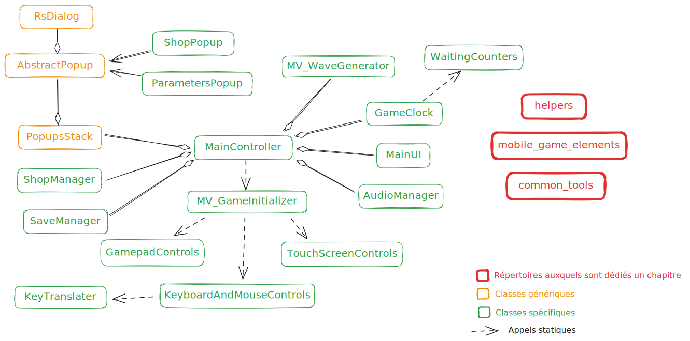
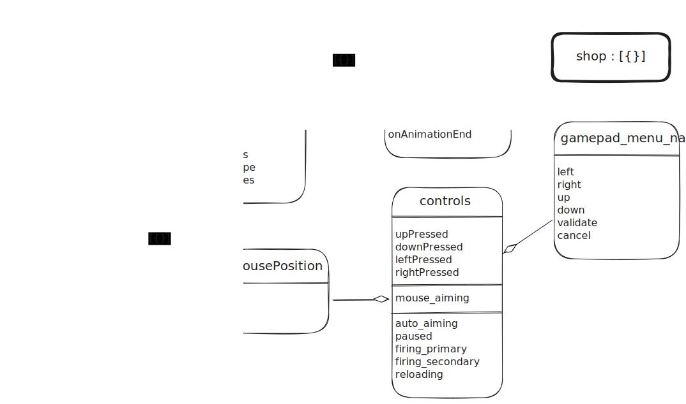
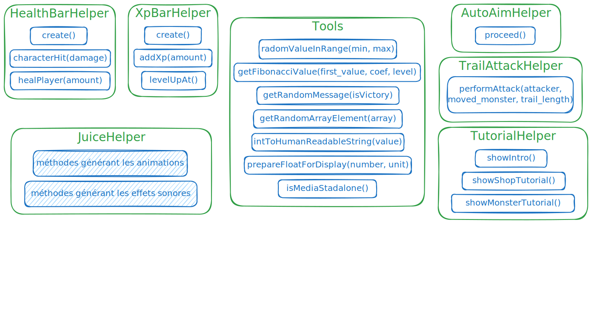

# Vue d'ensemble

À mesure que les fonctionnalités arrivent, le projet gagne en complexité (un projet informatique, quoi...).

L'architecture logicielle évolue au fil de l'eau, pour intégrer les nouveaux besoin à mesure qu'ils se présentent, c'est à dire potentiellement plusieurs fois par jour. 

C'est pourquoi, il est possible que les diagrammes est explications ci-dessous, ne soient pas tout à fait à jour, et pas suffisamment détaillés à votre goût : j'y reviens régulièrement, mais si je devais le modifier au fur et à mesure, je perdrais un temps considérable.

Merci de votre compréhension.

Pour en revenir à la présentation, je vous propose de parcourir les éléments constituant le projet, par thématiques.

## Genèse

Au moment de démarrer, j'ai commencé par rassembler des briques logicielles, provenant de mes précédents projets. Tel que je voyais l'architecture logicielle du projet à ce moment-là, elle devait ressembler à ceci :

## Aujourd'hui

Puis, une chose en entrainant une autre, la quasi-totalité de l'architecture a évolué, afin d'accueillir les nouvelles fonctionnalités, sans trop introduire de complexité inutile (si vous êtes développeur, vous savez ce que c'est :smirk:)

Le `MainController` déclare et définit tout le paramétrage par défaut, à travers des constantes. En outre, il implémente également l'initialisation du jeu, de même que les méthodes de détection et de gestion de fins de vagues, qu'il s'agisse de victoires ou de défaites.

Il s'appuie sur la classe statique `MV_GameInitializer` pour initialiser l'objet `scope`, préparer la gestion des contrôles, et instancier les divers objets chargés de  gérer les diverses problématiques : audio, sauvegarde, magasin d'améliorations, popups, génération des vagues de monstre, gamplay et ATH, et traitements périodiques (`GameClock`).

Les fenêtre modales gérées par `PopupsStack` sont des classes héritant de `AbstractPopup`, qui définit les méthodes invoquées par `PopupsStack`, ainsi que les méthodes permettant de gérer la navigation par manette, dans la fenêtre.

La classe `WaintingCounters` permet de gérer les délais d'attente, dépendant des TIK d'horloge gérés par `GameClock`. De cette manière, ces délais d'attente sont affectés par la mise en pause du jeu, contrairement aux animations pures.

## L'objet `scope`

Directement rattaché au `MainController`, l'objet `scope` est une banque de données définissant l'état du jeu, à un instant T.

`scope.shop` définit pour chaque article du magasin, le paramétrage nécessaires au calcul des prix et à l'affichage, ainsi que le niveau actuel d'amélioration, pour la partie en cours.

`scope.game` définit l'état actuel de la partie en cours, du point de vue du personnage : ressources du joueur, xp, numéro de la vague en cours, compteurs de délais, etc.

En outre, cette structure contient également le flag de préférences utilisateur concernant l'affichage des hit box, ainsi que les compteurs d'attente en cours (`waiting_counters`), et la planification de l'apparition des monstres de la vague en cours (`wave_pop`).

La liste `attacking_monsters` permet de gérer dans `WaitingCounters`, les compteurs d'attaques de monstres, en cours de préparation, et ainsi d'afficher et animer les jauges correspondantes.

La liste `flying_monsters` permet de gérer dans `WaitingCounters`, les animations de vol plané, pour les monstres lancés en cloche par un "golgoth".

`scope.controls` centralise l'état des commandes à l'instant T. Certains de ces états sont mutualisés entre les différents modes de contrôles (`auto_aiming`, `paused`, `firing_primary`, `firing_secondary`, `reloading`). Tous les autres sont chacun lié à un mode de contrôle spécifique.

* Clavier: `upPressed`, `downPressed`, `leftPressed`, `rightPressed`
* Souris: `mouse_aiming` et structure `mouse_position` (`x`, `y`)
* Manette dans les menus: structure `gamepad_menu_nav`

# Les common_tools

Ce répertoire contient des classes "utilitaires", réutilisables.

## Configuration de la manette

Le couple `GamepadGenericAdapter` + `GamepadConfigUI`, permet d'abstraire l'API native `Gamepad`, en générant une liste d'actions (avec fonction à exécuter au déclenchement), puis en mappant ces actions aux boutons de la manette via l'UI de configuration, dont l'ouverture automatique est déclenchée lorsqu'une manette est détectée.

Le `GamepadGenericAdapter` gère également le calibrage des joysticks. Celui-ci est initié automatiquement par `GamepadConfigUI`, lors de la fermeture de l'interface de configuration.

## ViewPortCompatibility

Cette classe gère un système de coordonnées virtuelles, et s'occupe de convertir ces valeurs de coordonnées en positionnement réel dans la viewport.

Pour faire simple : 

* elle assume un axe principal et une dimension virtuelle pour cet axe
* elle met à jour dynamiquement (à chaque resize) le ratio de la viewport, afin d'en extrapoler les dimensions virtuelles de l'écran sur l'axe secondaire
* le positionnement est exprimé en pourcentage des dimensions de la viewport sur l'axe principal => si l'axe principal est Y, alors la valeur réelle est exprimée en `vh`

## RS_Binding

Cette classe met en place un callback au niveau du setter de la propriété ciblé. 

En outre, la méthode `addBinding` permet ensuite de synchroniser la valeur de ladite propriété, avec une propriété d'un élément du DOM, car tel est le comportement du callback implanté par défaut.

La méthode `addBinding` peut être appelée autant de fois que nécessaire sur un object `RS_Binding`.

Il est cependant possible d'enrichir le setter callback par défaut, en alimentant une propriété `callback` dans l'objet fourni au constructeur de la classe. Ce callback sera ensuite exécuté juste avant les synchronisations avec les éléments de DOM, lorsque la valeur de la propriété est modifiée, et recevra en paramètre la nouvelle valeur ainsi que la valeur précédente.

## RS_Dialog et RS_Toast

Ce sont des composants de la RS_WCL (Roquefort Softwares' Web Components Library), un précédent side-project de mon cru.

`RS_Dialog` définit une fenêtre modale, ainsi que des "raccroucis" permettant de surcharger les fonctions `alert` et `confirm` en les remplçant par des instances de `RS_Dialog`.

`RS_Toast` permet d'afficher un toast, c'est à dire un message apparaissant en bas de l'écran, puis disparaissant au bout d'un certain temps.

## RS_Selector

Il s'agit d'un `customElement` utilisant un template HTML pour afficher un champ de sélection, façon interface de jeu vidéo.

Il est utilisé pour le paramétrage du type de clavier dans la boîte de dialogue des paramètres.

## MobileGameElement

Cette classe sert de "modèle" à toutes les classes gérant des objets affichés à l'écran et soumis à positionnement dynamique. 

Elle embarque tout le nécessaire pour gérer les diverses problématiques susceptibles d'être rencontrées :

* Elle gère le positionnement et l'orientation d'un conteneur DOM, qui lui est rattaché (`root_element`)
* Elle gère la traduction entre les coordonnées virtuelles et le positionnement en CSS (via une instance de `ViewPortCompatibility`)
* Elle offre la possibilité de n'appliquer les mouvements de rotation, qu'à un élément précis du DOM interne du conteneur (`rotation_element`)
* Elle permet d'accéder directement à la hitbox (intance de `RS_Hitbox`) et en embarque le système d'affichage

## RS_Hitbox

Cette classe définit une hitbox par ses coordonnée, ses dimensions et sa forme. Pour l'heure, seule la forme circulaire est gérée (parce que c'est suffisant).

Elle permet de :

* effectuer un test de collision avec une autre hitbox,
* calculer la distance avec une autre hitbox,
* calculer l'angle correspondant à la direction d'une autre hitbox,
* déterminer l'objet le plus proche, parmi une liste d'instances de `MobileGameElement`

# Les éléments du jeu

Parmi les briques conçues en amont pour les besoins d'autres projets, on retrouve `MobileGameElement`. 

Cette classe a quelque peu évolué. En effet, elle s'appuyait à l'origine sur `customElements` de l'API native, mais pour des raisons de compatibilité avec le navigateur Safari, j'ai dû "revoir ma copie", et choisir d'intégrer l'élément HTML à l'objet, plutôt que de faire hériter directement `HtmlDivElement` à la classe.

(C'est dommage : c'était drôlement pratique, puisque mes objets de jeu portaient par héritage, les méthodes et propriétés de l'élément de DOM qui les représentaient dans l'UI)

5 classes héritent de ce composant. Certaines n'utilisent pas toutes les fonctionnalités de `MobileGameElement` : par exemple, les frames animées ne se déplacent pas à l'écran et les tirs ne pivotent pas.

`MobileGameElement` gère la rotation, les déplacements, les hitbox, mais aussi et surtout, elle encapsule la conversion des coordonnées virtuelles en positionnement réel dans la vue.

Chacune des 5 classes, encapsule ensuite les propriétés et méthodes qui lui sont propres (c'est un peu le principe de l'héritage, quand même...)

`MV_Monster` définit les comportements communs à tous les monstres, quel que soit leur type. Chaque instance de la classe porte une propriété `monster_type` pointant sur le paramétrage du type de monstre qu'elle représente. Ainsi, beaucoup de choses ont pu être automatisées directement au sein de cette classe.

Une classe par type de monstre, hérite de `MV_Monster`, et définit les comportements spécifiques. Ces classes doivent obligatoirement implémenter certaines méthodes :

* `attack()` : c'est la méthode appelée par `GameClock` pour déclencher l'attaque du monstre
* `performAttack()` : c'est la méthode appelée par `WaitingCounters` pour déclencher l'attaque temporisée via l'appel à `timedAttack(fn_sound_fx)`

L'implémentation des méthodes de `MV_Monster` offre également des hooks, utilisables dans les classes enfant :

* `specificDeathEffect()` : est appelée au moment de la mort du monstre
* `choseFollowTarget()` : est appelée juste avant le déplacement, pour permettre la poursuite d'un autre élément que le joueur

# Les helpers: des classes statiques qui vous veulent du bien

Ces classes proposent des méthodes statiques permettant d'abstraire certains traitements, en le encapsulant dans des use cases nommés intelligiblement.

Ainsi, 

* `HealthBarHelper` et `XpBarHelper` permettent de gérer respectivement la santé et l'expérience du joueur, 
* `JuiceHelper` permet de créer des animation ainsi que les effets sonores, d'un simple appel de méthode, 
* `Tools` propose des fonctions utilitaires (oui, ok... c'est un fourre-tout... mais pas trop plein, vous en conviendrez),
* `AutoAimHelper` centralise la visée automatique du monstre le plus proche du joueur,
* `TrailAttackHelper` lance une attaque de type "trainée" (lancer ou dash),
* `TutorialHelper` gère le tutoriel intégré.

`HealthBarHelper`, `XpBarHelper`, `AutoAimHelper` et `TrailAttackHelper` sont plutôt orientées model, puisqu'elles embarquent de la logique, tandis que `Tools` expose des méthodes de calculs et de conversions généraliste, `JuiceHelper` abstrait les aspects liés au feedback auditif et visuel et `TutorialHelper` génère des boîtes de dialogue.

# Le gestionnaire de boutique

Les prix et les effets d'un article du magasin, sont calculés en fonction de son niveau actuel, en se basant sur une progression calquée sur la suite de Fibonnacci.
 

La classe `ShopItem` doit donc embarquer tout le nécessaire pour effectuer les calculs.

Une fois créé, un `ShopItem` fait sa vie : il met lui-même ses propres listeners en place.

La classe `ShopHealingItem` permet de gérer les articles de soin. Comme ces articles ne sont pas des améliorations, ils ne sont pas soumis aux même mécaniques que les autres articles du magasin, puisqu'ils ne sont pas liés à la liste `scope.shop`.

La classe statique `Abilities` est le helper de la boutique : elle expose des méthodes permettant d'obtenir les valeurs à appliquer en jeu, en fonction du niveau d'amélioration courant du `ShopItem` correspondant.

# Les entities

(Pas convaincu par le nom du répertoire... si j'en trouve un nom plus sympa, je reviendrai dessus)

## MV_GameInitializer

Comme son nom l'indique, il s'agit de la classe portant toutes les fonctions d'initialisation du jeu :

* Définit l'état par défaut des données internes (`scope`)
* Instancie les divers objets de gestion 
    * générateur de vague,
    * gestionnaire d'horloge,
    * gestionnaire de boutique, 
    * gestionnaire de fenêtres modales,
    * gestionnaire audio,
    * gestionnaire de sauvegardes,
    * gestionnaire de l'UI principale
* Met en place tout le nécessaire à la gestion des commandes du jeu, en s'appuyant sur les `controls_managers`

## MV_AudioManager

Le gestionnaire de sons, s'appuie sur la constante `SOUNDS_LIB`, pour mettre en place un système de pooling d'éléments `<audio>`, et en permettre le pilotage.

Il gère un pool d'éléments `<audio>` pour chaque son, et expose les méthodes nécessaires pour rendre triviale l'utilisation de la bibliothèque de sons et musqiues qu'il encapsule.

`playAudio` permet de jouer un son de la bibliothèque.

`stopAudioLoop` permet d'arrêter un son joué en boucle.

`stopMusic` permet d'arrêter tous les lecteurs identifiés comme référençant un son musical.

## MV_SaveManager

Le gestionnaire de sauvegarde gère le format de la sauvegarde et son stockage.

Il extrait les données du `scope` pour créer la sauvegarde, et calque le contenu de la sauvegarde dans le `scope` lors du chargement.

Les données sauvegardées sont :

* tout `scope.game`, à l'exception des propriétés liées à la vague en cours, et listées dans `__gameScopePropsFilter(key)`
* le niveau de chaque amélioration du magasin
* les paramètres audio (volumes et états d'activation)

## MV_WaveGenerator

Le générateur de vagues s'occupe de planifier l'apparition des monstres d'une vague. 

Une "valeur de combat" est calculée à partir du numéro de la vague courante. 

Le moteur de génération de vague s'appuie ensuite sur cette valeur, ainsi que sur le paramétrage des divers types de monstres, pour planifier un pop aléatoire.

En effet, chaque type de monstre se voit attribuer une "valeur de combat", et ne peut apparaître qu'à partir d'une certaine vague.

D'autre part, lorsqu'arrive la vague à partir de laquelle un type de monstre donné peut commencer à apparaître, le premier monstre de cette vague est un spécimen du type en question, et ce afin de mieux illuster la brève présentation de ce type de monstre par le tutoriel intégré.

# Les gestionnaires de vues

Nous avons évidemment la `MainUI`, qui gère l'interface du jeu en tant que tel, ainsi qu'une classe par type de fenêtre modale.

Ces classes tiennent lieu de controllers spécifiques, et gèrent la mise en place du binding, les événements détectés au sein de l'UI qu'elles gèrent, etc.

Exception faite de la `MainUI`, ces classes déclarent toutes une méthode `show`, responsable de la ouverture et de l'initialisation de la fenêtre modale, ainsi que d'une méthode `__close` assurant la fermenture de la popup, ainsi que l'exécution des opérations à effectuer à cette occasion.

En outre, dans le répertoire `view_managers`, on retrouve également le script `Popups.js`, dans lequel sont déclarées les classes `PopupsStack` et `AbstractPopup`, décrites dans le premier chapitre de la présente documentation.

# Les gestionnaires de commandes

Dans le répertoire `controls_managers`, on trouve une classe par type de contrôle. Clavier et souris sont regroupés dans une seule classe, car leur utilisation est liée.

Dans ces classes, on retrouve :

* l'initialisation des commandes (listeners, sauf pour la manette)
* la mise à jour des propriétés de `scope.controls` gérant l'état des commandes
* la mise en application dans le jeu, de l'état des propriétés de `scope.controls`
